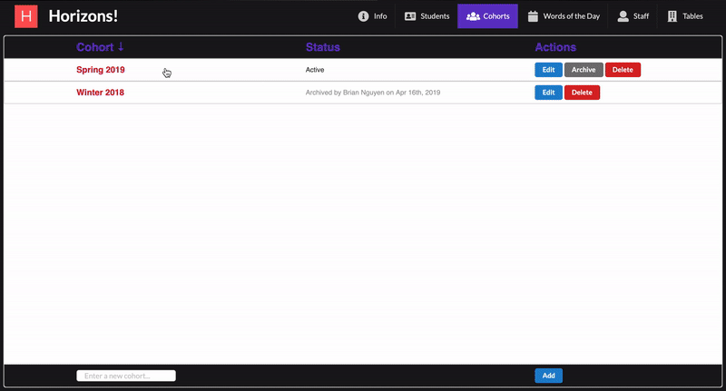
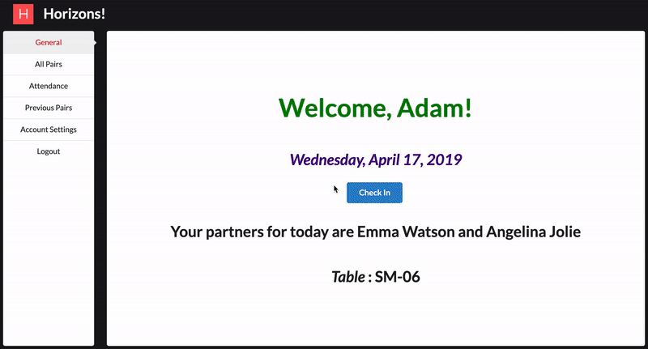

# Horizons App

https://horizons-app.herokuapp.com/

## Objective
 Creating a dashboard to enhance productivity & consistency in Horizons bootcamp's daily operations (e.g. manage student profiles, take attendance, assign programming partners, rate partners, etc.)

## Installation
To run this app locally, clone this repository and create an `.env` file

```
$ git clone git@github.com:bnguyen212/horizons-app.git
$ cd horizons-app
$ npm install
$ touch .env
```

Edit your `.env` file and make sure it contains the following variables
```
MONGODB_URI=YOUR_OWN_MONGODB_CREDENTIALS
HASHKEY=ANY_STRING_TO_BE_USED_FOR_HASHING_PASSWORDS
SESSION=ANY_STRING
```

Type `npm run dev` in the terminal to start running the app locally

## Preview - Staff




## Preview - Student



## Features
- Student Portal
  - Check in
  - View assigned partner(s) for the day
  - View personal attendance record
  - View and rate previous partners
  - Update password
- Staff Portal (for Admin and Instructor)
  - **Admin only** - manage staff accounts
  - **Admin only** - manage student accounts
  - **Admin only** - manage cohorts
  - **Admin only** - manage seating arrangements
  - Manage words of the day (students use correct WOTD to check in)
  - Check a student's profile, including: attendance, previously assigned partners, and ratings of/from partners
  - Check a cohort's daily attendance and assigned pairs
  - Assign student pairs (of 1, 2, or 3) to work on daily programming exercices
  - Check a pair's compatibility based on previous pairings and ratings


## Backend API Documentation
[https://airtable.com/shr3pEEVxY7oxLSaq/tblyUonlfYRsa2NBF](https://airtable.com/shr3pEEVxY7oxLSaq/tblyUonlfYRsa2NBF)


## Tech
- __Frontend__: React, Semantic UI
- __Backend__: Node.js, Express, MongoDB

## Author
Brian Nguyen - <a href="https://www.briannguyen.dev" target="_blank">Website</a> | <a href="https://github.com/bnguyen212" target="_blank">GitHub</a> | <a href="https://www.linkedin.com/in/brian-trong-nguyen/" target="_blank">LinkedIn</a>